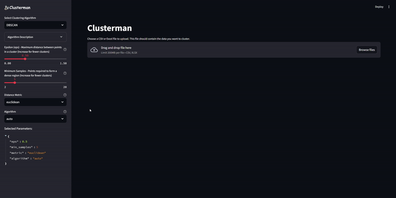

# Clusterman - Text Clustering Tool

A streamlined application for clustering text data using various algorithms and embeddings. This tool leverages Azure OpenAI's embedding models and provides multiple clustering algorithms with an interactive interface.



## 🌟 Features

- **Multiple Clustering Algorithms**
  - K-Means
  - DBSCAN
  - HDBSCAN
  - Agglomerative Clustering
  - more to come...

- **Easy LangChain Integration**
  - Seamlessly integrates with LangChain for generating embeddings
  - Supports various language models including GPT-4 and GPT-3.5 Turbo

- **Interactive Interface**
  - Real-time parameter tuning
  - Visual cluster analysis
  - Silhouette score evaluation

- **Efficient Processing**
  - Asynchronous task processing for embeddings and llm api requests
  - Rate limiting for API requests
  - Concurrent worker system
  - Utilizes Polars for fast DataFrame operations

## 🚀 Getting Started

### Prerequisites

- Python 3.8+
- Azure OpenAI API access (or and other llm api available through langchain)
- Required Python packages (see requirements.txt)

### Installation

1. Clone the repository:
```bash
git clone https://github.com/v-kam/clusterman
cd clusterman
```

2. Install dependencies:
```bash
pip install -r requirements.txt
```

3. Set up environment variables:
```bash
# Create a .env file with your Azure OpenAI credentials
AZURE_OPENAI_API_KEY=your_api_key
AZURE_OPENAI_ENDPOINT=your_endpoint
```

### Running the Application

```bash
streamlit run app.py
```

## 📖 Usage

1. **Upload Data**
   - Support for various file formats (CSV, Excel)
   - Automatic data preview

2. **Select Text Column**
   - Choose the column containing text data for clustering

3. **Configure Clustering**
   - Select clustering algorithm
   - Adjust algorithm parameters
   - View algorithm descriptions and recommendations

4. **Review Results**
   - Examine cluster assignments
   - Evaluate clustering quality via silhouette score
   - Analyze cluster distributions

5. **Generate Cluster Descriptions**
   - Use LLM to create summaries for each cluster

## 🛠 Architecture

- `src/models.py`: Azure OpenAI model configurations
- `src/async_queue.py`: Asynchronous task processing system
- `src/cluster_configs.py`: Clustering algorithm configurations
- `src/cluster_embeddings.py`: Core clustering functionality
- `src/polars_api_request.py`: Bulk API request handling

## 📊 Performance Considerations

- Rate limiting implemented for API requests
- Concurrent processing with configurable worker count
- Progress tracking for long-running operations
- Memory-efficient data handling using Polars DataFrame

## 🤝 Contributing

Contributions are welcome! Please feel free to submit a Pull Request.

## 📝 License

MIT License

## 🙏 Acknowledgments

- Azure OpenAI for embedding models
- Streamlit for the interactive interface
- scikit-learn for clustering algorithms
- LangChain for easy llm api integration
